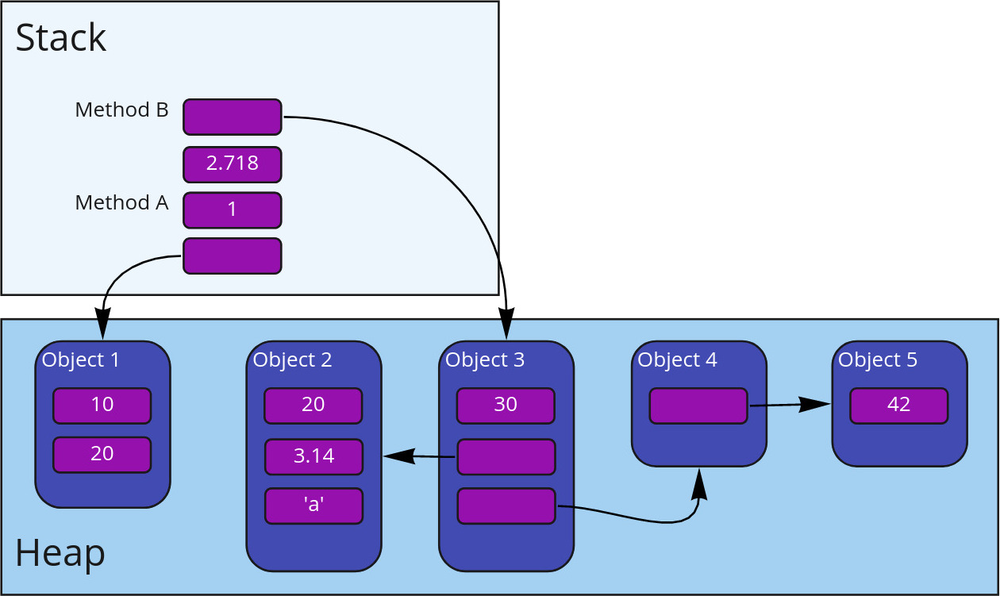
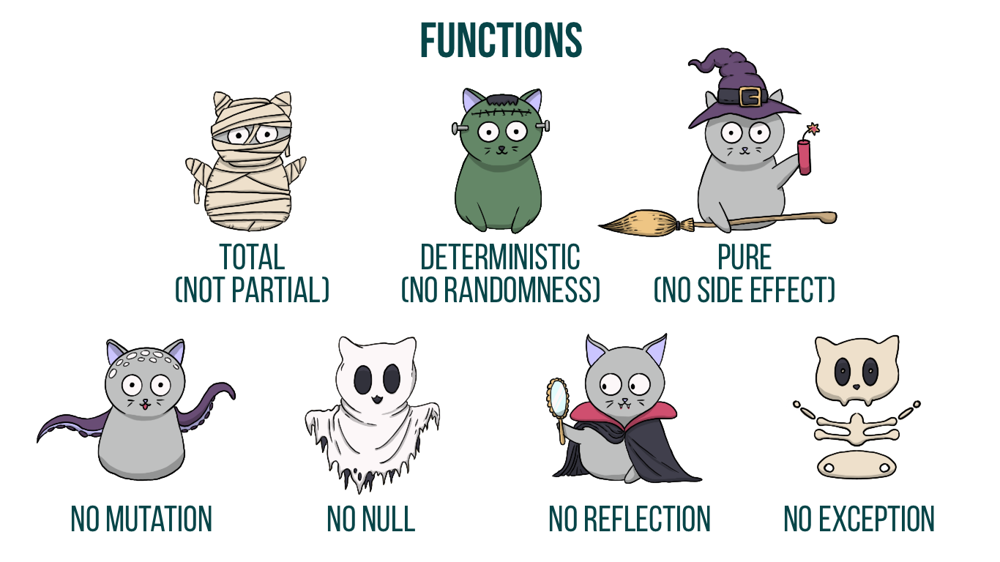

# Инсталиране на Scala

* Ще ни е нужна Java среда. Инсталирайте JDK (последната версия 21 работи перфектно, по-ранна също е ок)
  * OpenJDK от вашата дистрибуция (Linux) или [Adoptium Temurin](https://adoptium.net/)
* Не забравяйте да си зададете `JAVA_HOME` environment variable
* Инсталирайте [Coursier](https://get-coursier.io/docs/cli-installation)
* Пуснете `./cs setup`. Това ще ви инсталира няколко инструмента:
  - scala
  - scalac
  - sbt
  - scalafmt
  - amm
  - и други

# IDE или текстов редактор

Използвайте вашето любимо IDE или редактор:

* [IntelliJ Community Edition](https://www.jetbrains.com/idea/download/)
  - инсталирайте Scala plugin-а към него
* [Metals](https://scalameta.org/metals/) – имплементация на Language Server Protocol. Работи с:
  - Visual Studio Code
  - Vim
  - Emacs
  - Sublime Text
  - и други

# Scala инструменти

# Read-eval-print loop (REPL)

- интерактивен езиков шел
- стартира се от командния ред със `scala`

# Hello World

```scala
object HelloWorld:
  def main(args: Array[String]): Unit =
    println("Hello, World!")
```

# Компилиране и изпълнение

```
$ scalac HelloWorld.scala
$ scala HelloWorld
Hello, World!
```

# Hello World (Scala 3) { .scala3 }

```scala
@main
def hello = println("Hello, World!")
```

# Компилиране и изпълнение { .scala3 }

```
$ scalac HelloWorld.scala
$ scala hello
Hello, World!
```

# Скриптове

```
$ scala HelloWorld.scala
Hello, World!
```

# sbt, Scala/Simple Build Tool

build.sbt:

```scala
name := "hello-world"
version := "0.1"

scalaVersion := "3.3.1"

libraryDependencies ++= Seq(
  "org.scalatest" %% "scalatest" % "3.2.18" % Test
)
```

# sbt -- Директорийна структура

- `build.sbt`
- `src/main/scala` -- основен код
- `src/test/scala` - тестове

# sbt команди

- sbt \<команда\> -- изпълнява командата
- sbt -- влиза в интерактивен режим
- compile -- компилира кода
- run -- изпълнява обект с `main` метод
- console -- стартира REPL, в който е достъпно всичко от кода
- test -- пуска всички тестове

# Фиксиране на sbt версия

`project/build.properties`:

```
sbt.version=1.9.8
```

# Тестове

Използваме библиотеката [ScalaTest](https://www.scalatest.org/)

```scala
import org.scalatest.flatspec.AnyFlatSpec
import org.scalatest.matchers.should.Matchers

class ExampleSpec extends AnyFlatSpec with Matchers:
  "+" should "sum two numbers" in {
    2 + 3 shouldBe 5
  }
```

# Форматиране

# Включване на Java библиотеки

`build.sbt`:

```scala
name := "hello-world"
version := "0.1"

scalaVersion := "3.3.1"

libraryDependencies ++= Seq(
  // Java библиотека, може да се използва директно в Scala код
  "com.google.guava" % "guava" % "30.1-jre",

  // Scala библиотека,чрез %% sbt успява вземе артефакта за правилната версия на Scala
  "org.typelevel" %% "cats-core" % "2.10.0",

  // Test посочва, че библиотеката ще е налична само за тестовете (в src/test/scala)
  "org.scalatest" %% "scalatest" % "3.2.18" % Test
)
```

# Представете ни се за бонус точка

::: { .fragment }

Споделете няколко думи за себе си и своите интереси и качете снимка с инсталирана и работеща Scala в [**#да-се-представим**](https://scalafmi.slack.com/archives/C01P1KBSF54) в Slack за **1 бонус точка**.

:::

# Scala

# Типове и литерали

* `Boolean` (8 bits) – `true`, `false`
* `Char` (16 bits) – `'a'`, `'\n'`
* Числови типове
  * `Byte` (8 bits)
  * `Short` (16 bits)
  * `Int` (32 bits) – `42`, `0x2A`
  * `Long` (64 bits) - `100000L`, `0x186A0L`
  * `Float` (32 bits) – `3.14f`
  * `Double` (64 bits) – `3.14`
* `String` – `"Hey :)!"`

# Дефиниции

```scala
val a = 10 * 2 // неизменима променлива – винаги сочи към една и съща стойност
var b = 20 * 4 // изменима променлива – може да бъде пренасочвана
def c = 30 * 8 // стойността се преизчислява при всяко използване, не заема памет
```

::: { .fragment }

```scala
a = 100 // error: reassignment to val
b = 200 // успешно
```

:::

# Type inference

```scala
// компилаторът сам открива типа на променливите – String и Int
val inferred = "Hello, hello, hello"
def inferredSize = inferred.size

// типът се задава явно
val explicit: String = "Is there anybody in there?" 
def explicitSize: Int = explicit.size
```

# Функции

```scala
def fortyTwo = 42
def sum(a: Int, b: Int) = a + b

sum(fortyTwo, 58) // 100
```

Посочването на типовете на параметрите е задължително

::: { .fragment }

```scala
// посочването на типа на връщания резултат е опционално,
// но препоръчително за публични функции
def twice(str: String): String = str * 2
twice(":)") // ":):)"
```

:::

::: { .fragment }

```scala
println("You can see me on your screen :P") // Функциите могат да имат странични ефекти
```

:::

# Къде живеят дефинициите?

* В блок
* Като членове на класове, обекти и др.
* (от Scala 3) на топ ниво на файл

# Блокове

```scala
def solveQuadraticEquation(a: Double, b: Double, c: Double) = {
  def squared(n: Double) = n * n
  
  val discriminant = squared(b) - 4 * a * c
  val discriminantSqrt = math.sqrt(discriminant)

  val firstSolution = (-b - discriminantSqrt) / (2 * a)
  val secondSolution = (-b + discriminantSqrt) / (2 * a)
   
  (firstSolution, secondSolution) // Наредена двойка. Повече за тях по-късно в курса :)
}
```

# Членове

```scala
object TestApp:
  val a = 10 * 2
  var b = 20 * 4
  def c = 30 * 8

  def sum = a + b + c

  @main
  def main(args: Array[String]) = println("The sum is: " + sum)
``` 

# Топ ниво във файл { .scala3 }

`TestApp.scala`:

```scala
val a = 10 * 2
var b = 20 * 4
def c = 30 * 8

def sum = a + b + c

@main def printSum = println("The sum is: " + sum)
```

# Файлове и пакети

Класовете, обектите, а от Scala 3 всички дефиниции,<br />
се поставят във файл със `.scala` разширение.

::: { .fragment }

Всеки от тях принадлежи на определен пакет,<br />който се отбелязва преди дефинициите:

```scala
package com.scalafmi

val a = 10 * 2
var b = 20 * 4
def c = 30 * 8

def sum = a + b + c

@main def printSum = println("The sum is: " + sum)
```

:::

::: { .fragment }

Конвенция е файловете да се намират в директория,<br />съответстваща на пакета им.

:::

# Още дефиниции

```scala
type Person = String
type Address = String

def describe(name: Person, address: Address) = name + "'s address is: " + address

describe("Viktor", "Pazardzhik") // "Viktor's address is: Pazardzhik"
```

::: { .fragment }

```scala
val ThisIsAConstantByConvention = 3.14 // имената на константите започват с главна буква
```

:::

# Още низови литерали

* Интерполация
* raw низове
* Многоредови низове

# Интерполация

```scala
def describe(name: Person, address: Address, age: Int) =
  s"$name's address is: ${twice(address)}. He is $age years old"

// "Viktor's address is: PazardzhikPazardzhik. He is 25 years old"
describe("Viktor", "Pazardzhik", 25)
```

# raw низове

```scala
val evilLaughter = "Muhahahaha :D!"
raw"Escaping has no\\power \t here\n. $evilLaughter" // Escaping has no\\power \t here\n. Muhahahaha :D!
"Escaping works \\ \there\n" // Escaping works \     here<newline>
```

Полезно за регулярни изрази и други

# Многоредови низове

```scala
val sql = """
    SELECT id, name, address, age
    FROM Person
    WHERE hometown = 'Varna'
    """
```

::: { .fragment }

Премахване на интервалите в началото:

```scala
 val sql =
   """SELECT id, name, address, age
      |FROM Person
      |WHERE hometown = 'Varna'
      |""".stripMargin
```

:::

# Всяка стойност е обект

::: { .fragment }

Включително тези на основните типове

```scala
-42.abs // 42
1.to(10) // Range 1 to 10 (inclusive)
1.until(10) // Range 1 until 10
1.+(2) // 3, всички оператори са също методи!
4.*(5) // 20
```

:::

::: { .fragment }

Инфиксен запис (само за методи на един параметър)

```scala
1 to 10 // Range 1 to 10 (inclusive)
1 until 10 // Range 1 until 10
1 + 2 // 3
4 * 5 // 20
```

:::

# Да, имената могат да са символни:

```scala
val ==> = "An arrow"
def **(a: Double, b: Double): Double = math.pow(a, b)

**(2.0, 10.0) // 1024.0
```

::: { .fragment }

Не могат да се смесват с букви/цифри:

```scala
val **Power = "**" // грешка!
```

:::

# `if` конструкция

```scala
val n = 72

if n > 42 then "Greater than the ultimate answer"
else if n == 42 then "The answer"
else "Not there yet"
```

# Всичко е израз

<p class="fragment">И си има стойност и тип</p>

::: { .fragment }

```scala
val n = 72

val evaluation =
  if n > 42 then "Greater than the ultimate answer"
  else if n == 42 then "The answer"
  else "Not there yet"

evaluation // Greater than the ultimate answer
```

:::

::: { .fragment }

```scala
def fact(n: Int): Int =
  if n <= 1 then 1
  else n * fact(n - 1)
```

:::

# В Java (и други)

```java
public int maxSquared(int a, int b) {
  int max;
  
  if (a > b) {
    max = a;
  } else {
    max = b;
  }

  return max * max;
}
```

В Java сме задължени да извършим мутация/страничен ефект в `if`

# В Scala

```scala
def maxSquared(a: Int, b: Int) = {
  val max = if a > b then a else b
  max * max
}
```

В Scala изглежда по-математично и ясно

# Блоковете също са изрази!

```scala
val a = 2
val b = 10
val c = 5

val discriminantSqrt = {
  val discriminant = b * b - 4 * a * c

  math.sqrt(discriminant)
}
```

```scala
def maxSquared(a: Int, b: Int) = {
  val max = if a > b then a else b
  max * max
}
```

Оценяват се до последния statement в тях

# Блоковете като изрази (допълнение)

```scala
def squared(n: Int) = n * n

squared(10)
squared({
  val complicatedCalculation = 1 + 2 + 3 + 4

  complicatedCalculation / 2 
})
```

::: { .fragment }

```scala
squared {
  val complicatedCalculation = 1 + 2 + 3 + 4

  complicatedCalculation / 2 
}

println {
   val result = squared(42)

   s"The result is: $result"
}
```

При функции на един параметър Scala ни позволява<br />да пропускаме кръглите скоби

:::

# Блокове чрез индентация { .scala3 }

Scala 3 ни позволява вместо чрез скоби да определяме блокове чрез индентация:

::: { .fragment }

```scala
def solveQuadraticEquation(a: Double, b: Double, c: Double) =
  def squared(n: Double) = n * n
  
  val discriminant = squared(b) - 4 * a * c
  val discriminantSqrt = math.sqrt(discriminant)

  val firstSolution = (-b - discriminantSqrt) / (2 * a)
  val secondSolution = (-b + discriminantSqrt) / (2 * a)
   
  (firstSolution, secondSolution) // Наредена двойка. Повече за тях по-късно в курса :)
```

:::

::: { .fragment }

```scala
val theAnswerSquared =
  val a = 42
  a * a
```

:::

# Блокове чрез индентация { .scala3 }

```scala
if n > 42 then 
  val greater = "Greater"
  s"$greater than the ultimate answer"
else if n == 42 then "The answer"
else "Not there yet"
```

::: { .fragment }

От тук нататък ще използваме само този стил

:::

::: { .fragment }

От Scala 3.3 може да го правим и при аргументи на функция:

```scala
println {
  val result = squared(42)
  
  s"The result is: $result"
}

// ->

println:
  val result = squared(42)
  
  s"The result is: $result"
```

:::

# Типова йеархия


# [`Any`](https://scala-lang.org/api/3.x/scala/Any.html)

::: incremental

* Родител на всички други типове
* Сравнение по стойност: `==`, `!=`

  ```scala
    42 == 84 / 2 // true
    "Abc" != "Абв" // true
  ```
* Hash код: `##`

  ```scala
    "Have a good day :)!".## // -244558110
    10.0.## // 10
  ```

* `isInstanceOf[T]`, `asInstanceOf[T]`
* `toString`

:::

# [`AnyVal`](https://scala-lang.org/api/3.x/scala/AnyVal.html) и [`AnyRef`](https://scala-lang.org/api/3.x/scala/AnyRef.html)

::: incremental

* JVM разделя типовете на примитивни и референтни
* Примитивните (`AnyVal`) се съхраняват в променливи чрез тяхната стойност
* Стойността на референтните (`AnyRef`) се съхранява в Heap-а като обект
  - Променливите съхраняват референция към този обект
  - Обектите подлежат на Garbage Collection

:::

# `AnyVal` и `AnyRef`

```scala
val i = 42
val j = i

val strA = "Hello, Goodbye"
val strB = strA

val arr1 = Array(1, 2, 3)
val arr2 = arr1
arr2(0) = 100 
```

{ height="256" .fragment }

# Java Memory Model



# Java Memory Model


# `AnyRef` -- референция vs стойност

```scala
val name = "Tihomira"
s"Hello $name" == s"Hello $name" // true
s"Hello $name" eq s"Hello $name" // false
```

# Типова йеархия


# println???

Какъв е типът на:

```scala
println(":)")
```

# [`Unit`](https://scala-lang.org/api/3.x/scala/Unit.html)

::: incremental

* Съдържа една единствена стойност -- `()`
* Изразява страничен ефект

:::

::: { .fragment }

```scala
val printed: Unit = println(":)")

var mutable = 10
val mutationResult: Unit = mutable = 20
```

:::

::: { .fragment }

```scala
val a = 10
val b = 20

// Конвенция за функции без аргументи
def mult = a * b // Чисти функции пишем без скоби
def printMult() = println(a * b) // Функции със странични ефекти пишем със скоби
```

:::

# [`Null`](https://scala-lang.org/api/3.x/scala/Null.html)

::: incremental

* Съществува единствено заради съвместимост с Java
* Всички `AnyRef` типове имат `null` стойност
* В Scala я избягваме колкото можем

:::

# [`Nothing`](https://scala-lang.org/api/3.x/scala/Nothing.html)

::: incremental

* Подтип на всички други типове
* Няма нито една стойност от тип `Nothing`

:::

{ .fragment }

<p class="fragment">Необходим за цялостност на някои изводи на ниво типова система</p>


# Тип на изключенията?

```scala
throw new RuntimeException()
```

::: { .fragment }

```scala
def fail(reason: String): Nothing = throw new RuntimeException(reason)

def failingSqrt(n: Int) =
  if n >= 0 then math.sqrt(n)
  else fail(s"Square root of $n is not real")

failingSqrt(-1) // Какъв е типът?
```

:::

# Filling the blanks

```scala
def ??? : Nothing = throw new NotImplementedError

def twice(n: Int): Int = ???
def fib(n: Int): Int = ???

def fibDoubled(n: Int): Int = twice(fib(n)) // Компилира се
```

# `if` с разнородни типове

::: { .fragment }

```scala
if 42 > 0 then true else 0
if 42 > 0 then "String" else println("String")
if 42 > 0 then 0
```

:::

::: { .fragment }

```scala
if 42 > 0 then true else 0 // AnyVal
if 42 > 0 then "String" else println("String") // Any
if 42 > 0 then 0 // AnyVal; else частта се счита за Unit
```

:::

# Pattern **Matching**

```scala
def stringify(n: Int): String = n match
  case 1 => "One"
  case 2 => "Two"
  case 3 => "Three"
  case _ => "I can only count to three :("

stringify(2) // Two
```

::: { .fragment }

```scala
def parseBoolean(boolean: String): Boolean =
  boolean match
    case "true" | "True" | "TRUE" => true
    case "false" | "False" | "FALSE" => false
    case _ => false

parseBoolean("True") // true
```

:::

# Pattern **Matching**

```scala
def toInteger(value: Any): Int =
  value match
    case n: Int => n
    case s: String => s.toInt
    case d: Double => d.toInt

toInteger("42") // 42
```

# Конструкции със странични ефекти

# while

```scala
var i = 0

while i < 10 do
  println(i)
  i += 1

println(i)

// 0 1 2 3 4 5 6 7 8 9 10
```

# Прихващане на изключения

```scala
val parsedResult =
  try "42L".toInt
  catch
    case e: NumberFormatException => 0

parsedResult // 0 
```

# for

```scala
for
  i <- 1 to 4
do println(i)

// 1 2 3 4
```

# for - съставни части

* генератори
* филтри
* дефиниции

::: { .fragment }

```scala
for 
  i <- 1 to 4 // генератор
  if i % 2 == 0 // филтър 
  c <- 'a' to 'c' // генератор
  s = s"$i$c" // дефиниция
do println(s)

// 2a 2b 2c 4a 4b 4c
```

:::

# Съставни типове

# Наредени n-торки (Tuples)

```scala
val person: (String, Int, String) = ("Ivan", 27, "Sofia")
```

::: { .fragment }

```scala
def greeting(person: (String, Int, String)): String =
  s"Hello, I am ${person._1} from ${person._3}. I am ${person._2} years old"
```

:::

<p class="fragment">Хетерогенен тип с фиксиран размер</p>

# Хомогенни колекции

`Range`, `List[A]`, `Set[A]`, `Map[K, V]`

::: incremental

* `Range` -- целочислен интервал

  ```scala
  scala> (1 to 10)
  val res0: scala.collection.immutable.Range.Inclusive = Range 1 to 10
  
  scala> (1 until 10)
  val res1: scala.collection.immutable.Range = Range 1 until 10
  ```
* `List[A]` -- нареден списък

  ```scala
  val xs = List(1, 2, 3)
  xs.head // 1
  
  val specialSyntax = 1 :: 2 :: 3 :: Nil
  specialSyntax.head // 1
  
  // оператори, завършващи с `:`, се прилагат върху обекта отдясно
  val specialSyntaxActual = Nil.::(3).::(2).::(1)
  ```

:::

# Хомогенни колекции

::: incremental

* `Set[A]` -- множество (без наредба)

  ```scala
  val set = Set(10, 11, 12)
  set(11) // true
  set(20) // false
  ```
* `Map[K, V]` -- речник (без наредба)

  ```scala
  val numberToString: Map[Int, String] = Map(1 -> "One", 2 -> "Two", 3 -> "Three")
  numberToString(1) // "One"
  ```

:::

# Операции върху колекции

```scala
val xs = List(1, 2, 3, 4, 5)

xs.isEmpty // false
xs.size // 5
xs.head // 1
xs.tail // List(2, 3, 4, 5)
xs.take(3) // List(1, 2, 3)
xs.drop(2) // List(3, 4, 5)
xs.sum // 15; работи само за колекции от числени елементи
```

# Map е колекция от tuple-и

```scala
Map(1 -> "One", 2 -> "Two", 3 -> "Three").head // (1, "One")
```

# String е колекция от Char

```scala
"abcdef".head // 'a'
"abcdef".drop(2) // "cdef"
```

# Range и List[A] са подтипове на Seq[A]

```scala
def sum(xs: Seq[Int]): Int = ???
```

::: {.fragment}

```scala
def sum(xs: Seq[Int]): Int =
  if xs.isEmpty then 0
  else xs.head + sum(xs.tail)

sum(1 to 10) // 55
sum(List(1, 2, 3, 4)) // 10
```

:::

# Задача

Напишете функция, проверяваща, че скобите в един израз са балансирани

```scala
def balanced(e: List[Char]): Boolean = ???
```

# Типови параметри

::: incremental

* `List[A]`, `Set[A]`, `Map[K, V]` са параметризирани типове
* `type` дефинициите също могат да приемат параметри:

  ```scala
  type Index[V] = Map[Int, V]
  
  def retrieveLast[V](index: Index[V]): V = index(index.keys.max)
  
  retrieveLast(Map(5 -> "Five", 1 -> "One")) // Five
  ```

:::

# Функционален for :)

```scala
val squared = for
  x <- List(1, 2, 3, 4)
yield x * x

squared // List(1, 4, 9, 16)
```

# Функционален for

```scala
val result = for
  x <- List(1, 2, 3, 4, 5)
  if x % 2 != 0
  y <- List(x, x * 2, x * 3)
yield (x, y)

result // List((1,1), (1,2), (1,3), (3,3), (3,6), (3,9), (5,5), (5,10), (5,15))
```

# Задача

Генерирайте всички възможни поднизове на даден низ

```scala
def substrings(str: String): List[String] = ???
```

# Scala 2 и Scala 3 синтаксис

* Scala 3 въведе опростение на синтаксиса на езика с цел четимост
* Optional braces
* Блокове чрез индентация
* `if` без скоби, но с `then`
* Все още доста код и документация са написани на стария синтаксис. Та нека да се запознаем с него

# Braces – опционални в Scala 3

```scala
def discriminantSqrt(a: Double, b: Double, c: Double) =
  val discriminant = b * b - 4 * a * c

  math.sqrt(discriminant)
```

```scala
object HelloWorld:
  def sayHiTo(name: String) = s"Hi $name!"
  
  def sayHiToTheWorld = sayHiTo("World")
```

```scala
booleanString match
  case "true" | "True" | "TRUE" => true
  case "false" | "False" | "FALSE" => false
  case _ => false
```

```scala
try "42L".toInt
catch
  case e: NumberFormatException => 0
```

# Braces – задължителни в Scala 2

```scala
def discriminantSqrt(a: Double, b: Double, c: Double) = {
  val discriminant = b * b - 4 * a * c

  math.sqrt(discriminant)
}
```

```scala
object HelloWorld {
  def sayHiTo(name: String) = s"Hi $name!"

  def sayHiToTheWorld = sayHiTo("World")
}
```

```scala
booleanString match {
  case "true" | "True" | "TRUE" => true
  case "false" | "False" | "FALSE" => false
  case _ => false
}
```

```scala
try "42L".toInt
catch {
  case e: NumberFormatException => 0
}
```

# Контролни структури – Scala 3

```scala
for
  x <- List(1, 2, 3, 4, 5)
  if x % 2 != 0
  y <- List(x, x * 2, x * 3)
yield (x, y)
```

```scala
for 
  i <- 1 to 4
do println(s)
```

```scala
while i < 10 do
  println(i)
  i += 1
```

```scala
if n > 42 then "Greater than the ultimate answer"
else if n == 42 then "The answer"
else "Not there yet"
```

# Контролни структури – Scala 2

```scala
for {
  x <- List(1, 2, 3, 4, 5)
  if x % 2 != 0
  y <- List(x, x * 2, x * 3)
} yield (x, y)
```

```scala
for {
  i <- 1 to 4
} println(s)
```

```scala
while (i < 10) {
  println(i)
  i += 1
]
```

```scala
if (n > 42) "Greater than the ultimate answer"
else if (n == 42) "The answer"
else "Not there yet"
```

# Блокове и контролни структури –<br />Scala 3

```scala
if n > 42 then
  val difference = n - 42
  "Greater than the ultimate answer with difference of $difference"
else if n == 42 then "The answer"
else "Not there yet"
```

```scala
for
  x <- List(1, 2, 3, 4, 5)
  if x % 2 != 0
  y <- List(x, x * 2, x * 3)
yield
  val firstElement = s"x: $x"
  val secondElement = s"y: $x"

  (firstElement, secondElement)
```

Блокове чрез индентация – приложимо при<br />всички контролни структури

# Блокове и контролни структури –<br />Scala 2

```scala
if (n > 42) {
  val difference = n - 42
  "Greater than the ultimate answer with difference of $difference"
} else if (n == 42) "The answer"
else "Not there yet"
```

```scala
for {
  x <- List(1, 2, 3, 4, 5)
  if x % 2 != 0
  y <- List(x, x * 2, x * 3)
} yield {
  val firstElement = s"x: $x"
  val secondElement = s"y: $x"

  (firstElement, secondElement)
}
```

Блокове чрез скоби – приложимо навсякъде,<br />където е необходима стойност

# Консистентен синтаксис

::: { .fragment }

Scala 3 приема и двата синтаксиса

:::

::: { .fragment }

В курса ще използваме консистентно новия

:::

::: { .fragment }

В `build.sbt`:

```scala
scalacOptions ++= Seq(
  "-new-syntax",
)
```

:::

# Още за функциите

* типови параметри
* overloading
* default стойности на параметрите
* именувани аргументи
* променлив брой параметри

# Полиморфизъм чрез типови параметри

```scala
def repeat[A](value: A, times: Int): List[A] =
  if times == 0 then List.empty // or List.empty[A], but A is inferred
  else value :: repeat(value, times - 1)

repeat("Hello", 3) // List("Hello", "Hello", "Hello")
```

# Полиморфизъм чрез overloading

```scala
def twice(n: Int) = n * 2
def twice(d: Double) = d * 2
def twice(str: String) = str * 2

twice(10) // 20
twice(10.0) // 20.0
twice("10") // "1010"
```

# Default стойности на параметрите

```scala
def enlist(items: List[String], separator: String = ", ") = items.mkString(separator)

val ingredients = List("1 egg", "200 ml milk", "1/2 cup of sugar", "2.5 cups of flour")
enlist(ingredients) // 1 egg, 200 ml milk, 1/2 cup of sugar, 2.5 cups of flour
enlist(ingredients, ";") // 1 egg;200 ml milk;1/2 cup of sugar;2.5 cups of flour
```

# Именувани аргументи

```scala
def draw(
  text: String,
  textColour: String = "Blue", 
  backgroundColour: String = "White"
): String =
  s"This is the text $text written with $textColour letters on $backgroundColour background"

draw("Hello")
draw("Hello", backgroundColour = "Cyan")
draw(backgroundColour = "Purple", textColour = "White", text = "Hello")
```

# Променлив брой параметри

```scala
def enlist(first: String, rest: String*) = (first +: rest).mkString(", ")

// 1 egg, 200 ml milk, 1/2 cup of sugar, 2.5 cups of flour
enlist("1 egg", "200 ml milk", "1/2 cup of sugar", "2.5 cups of flour")
```

::: {.fragment}

```scala
val ingredients = List("1 egg", "200 ml milk", "1/2 cup of sugar", "2.5 cups of flour")
// A pinch of love, 1 egg, 200 ml milk, 1/2 cup of sugar, 2.5 cups of flour
enlist("A pinch of love", ingredients*)
```

:::

::: {.fragment}

```scala
enlist("A cake") // A cake
enlist() // не се компилира
```

:::

# Функционално програмиране

# Какво е функция?

<p class="fragment">Според математиката:<br />Релация на две множествена `X` и `Y`, съпоставяща<br />елементи от `X` към елементи от `Y`</p>

# Функциите са:

::: incremental

* детерминистични -- един и същи вход винаги води до един и същи изход
* чисти -- без странични ефекти
* тотални -- дефинирани за всеки вход *(good to have)*

:::

#



# Функционално срещу императивно

# Императивни програми

::: incremental

* командваме програмата какво да направи
* постъпкови изчисления във времето
* всеки statement зависи от всички предишни
* трудни за проследяване -- трябва да имаме предвид всяка една стъпка и нейния ред

:::

# Функционални програми

::: incremental

* трансформират стойности
* декларативно -- описваме проблема чрез "какво", а не "как"
* изразите са единственото, определящо зависимости
  ```scala
  val a = 10
  val b = 40
  val c = 50
  
  val x = a + c
  val y = b * 40
  
  val z = y * x * x
  ```
* лесни за проследяване и за разсъждаване върху тях
* неизменими структури и липса на странични ефекти
* времето е "спряло"
* лесна композиция на отделните части

:::

# Моделиране на времето

```scala
val oldZdravko = Person("Zdravko", 32, "Varna", "Bulgarian")
val newZdravko = oldZdravko.copy(age = 33, address = "Sofia")

oldZdravko.sayHiTo(newZdravko) // и двете версии на Здравко продължават да съществуват
```

<p class="fragment">Функционалното програмиране работи с факти</p>

# Програма без странични ефекти програма ли е?

::: { .fragment }

Ще разгледаме множество функционални средства за ограничаване на страничните ефекти само до определени места

:::

::: { .fragment }

„Програма като стойност“

:::

# Functional Wizard

{ height="512" }

Controls time & space

# Има място и за двете

::: incremental

* Императивното е незаминимо при някои алгоритми и оптимизации
* Функционалното прави останалите части на програмата по-ясни
  - ясна композитност между компоненти

:::

# "If a tree falls in a forest and no one is around to hear it, does it make a sound?"

<p class="fragment">Напълно приемлово е функция да използва mutable state,<br />ако е само вътрешен за нея</p>

<p class="fragment">Тоест не може да бъде наблюдаван външно</p>

# Модел на изчисление

<p class="fragment">Колко от вас са учили СЕП?</p>

# Substitution model (операционна семантика)

```scala
def max(a: Int, b: Int) = if a > b then a else b

max(3 * 4, 2 * 3)
```

# Предаване на параметрите по стойност

::: incremental

* `max(3 * 4, 2 * 3)`
* `max(12, 6)`
* `if 12 > 6 then 12 else 6`
* `if true then 12 else 6`
* `12`

:::

# Предаване на параметрите по име

::: incremental

* `max(3 * 4, 2 * 3)`
* `if (3 * 4) > (2 * 3) then (3 * 4) else (2 * 3)`
* `if (12) > (6) then (3 * 4) else (2 * 3)`
* `if true then (3 * 4) else (2 * 3)`
* `3 * 4`
* `12`

:::

# Предаване на параметрите по име

```scala
def max(a: => Int, b: => Int) = if a > b then a else b

max(3 * 4, 2 * 3)
```

# Предаване на параметрите по име

```scala
def ||(a: Boolean, b: => Boolean): Boolean = if a then true else b

||(true, {
  println("Won't be printed")
  false
}) // true

||(false, {
  println("Will be printed")
  false
}) // false
```

# Предаване на параметрите по име

```scala
def describeByValue(items: List[Int], evaluation: Int): String = 
  if items.isEmpty then "No items available"
  else s"Items: ${items.mkString(", ")} are evaluated to $evaluation"

def describeByName(items: List[Int], evaluation: => Int): String =
  if items.isEmpty then "No items available"
  else s"Items: ${items.mkString(", ")} are evaluated to $evaluation"

def avg(xs: List[Int]) = xs.sum / xs.size
```

::: {.fragment}

```scala
val someItems = List(1, 2, 3)
describeByName(someItems, avg(someItems)) // Items: 1, 2, 3 are evaluated to 2
describeByValue(someItems, avg(someItems)) // Items: 1, 2, 3 are evaluated to 2
````

:::

::: {.fragment}

```scala
val noItems = List.empty[Int]
describeByName(noItems, avg(noItems)) // No items available
describeByValue(noItems, avg(noItems)) // java.lang.ArithmeticException: / by zero
```

:::

# Защо ни е нужно по име?

::: incremental

* short circuiting и собствени контролни структури

  ```scala
  fastComputation orElse longComputation
  ```
* Отлагане на изчисления
  - безкрайни структури от данни
  - изпълнение по-късно или в друга нишка
* Повторно изпълнение на изрази със странични ефекти

:::

# Модел на изчисление в Haskell

```scala
def squared(n: => Int): Int =
  lazy val nValue = n
  nValue * nValue
```

# Референтна прозрачност

Израз е референтно прозрачен, ако може да бъде заменен от своята стойност без това да променя поведението на програмата

<p class="fragment">Substitution модела работи само за референтно прозрачни изрази</p>

# Референтна прозрачност

```scala
// 1
val a = 1 + 2
List(а, a)

// 2
List(1 + 2, 1 + 2)

// 3
List(3, 3)
```

# Референтна прозрачност

```scala
// 1
val a = {
  println("Hey there!")
  1 + 2
}

List(a, a)

// 2
List({
  println("Hey there!")
  1 + 2
}, {
  println("Hey there!")
  1 + 2
})

// 3

List(3, 3)
```

# Изключенията не са референтно прозрачни

```scala
def exceptionThrowingFails(x: String): String =
  val y: String = throw new Exception()
  
  try x + y
  catch
    case _: Exception => ""
```

::: {.fragment}

```scala
def exceptionThrowingComputes(x: String): String = 
  try x + (throw new Exception())
  catch 
    case _: Exception => ""
```

:::

# Как да пишем функционално?

* Основни подходи
  - Рекурсия
  - Функциите като първокласни обекти
  - Функции от по-висок ред
  - Неизменими структури от данни
  - Композитност
* Дизайн чрез типове и данни. Средства за трансформация на данни
* Работа с грешки и изключителни ситуации
* Контрол над страничните ефекти и ограничаването им
* Абстракции от по-висок ред

# Въпроси :)?
