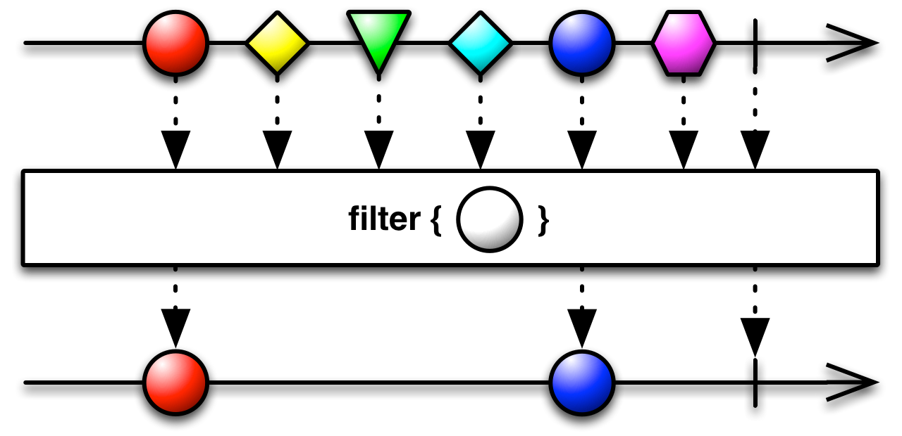
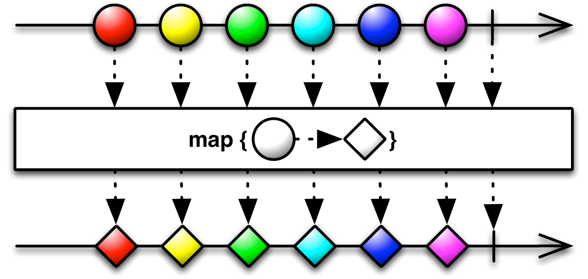
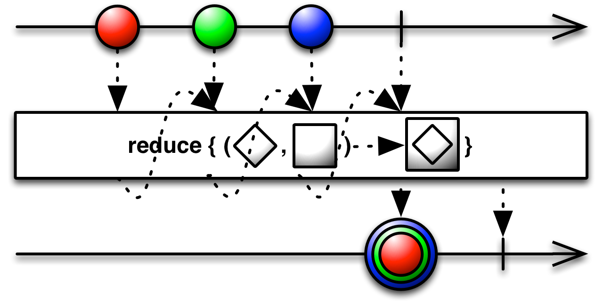
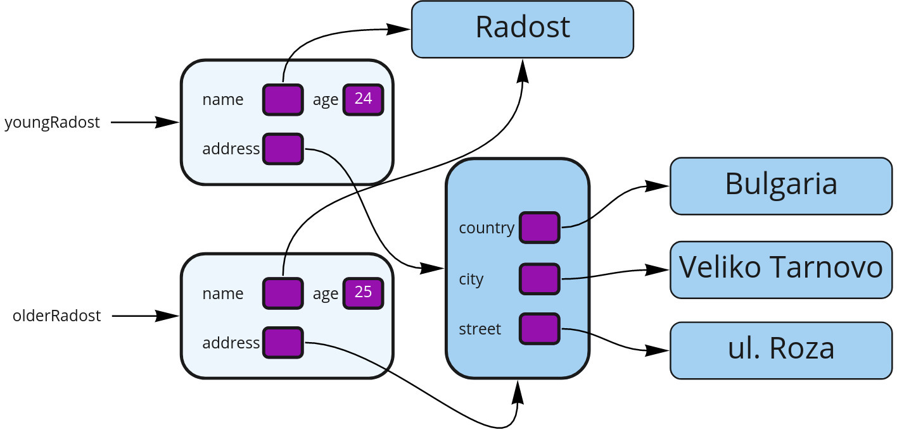
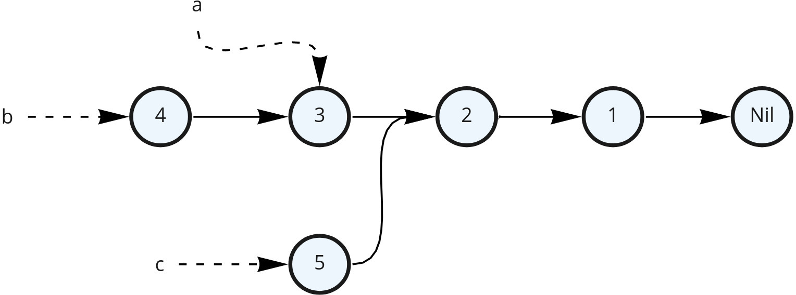

# За какво ще говорим

::: incremental

* Рекурсия
  * Опашкова рекурсия, практични примери
* Функциите като първокласни обекти
    * ламбда фунцкии и функционален тип
    * Функции от по-висок ред - `map`, `filter`, `fold` и други
    * Currying - защо и кои са средствата, които Скала ни дава
* Композиция на функции
* Неизменимост и неизменими структури от данни
* Изразяване чрез типове

:::

# Рекурсия

::: incremental

* Функция, която извиква себе си
  
  { height=200 .fragment }
* Използва се за постигане на цикличност. Често срещано във ФП
* Избягва мутиране на състояние
* По-естествен начин за описване на определени алгоритми. Пример - fact
  ```scala
  def fact(n: Int): Int =
    if n <= 1 then 1
    else n * fact(n - 1)
  ```

:::

# Примери

```scala
def sum(l: List[Int]): Int =
  if l.isEmpty then 0
  else l.head + sum(l.tail)

def size[A](l: List[A]): Int =
  if l.isEmpty then 0
  else 1 + size(l.tail)

def fibonacci(i: Int): Int = ???
```

# Unfolding the recursion

```scala
def fact(n: Int): Int =
  if n <= 1 then 1
  else n * fact(n - 1)
```

::: incremental

* Използвайки substitution model
  
  ```
  fact(5)
  --
  5 * fact(5 - 1) =
  --
  5 * fact(4) =
  --
  5 * (4 * fact(4 - 1)) =
  --
  5 * (4 * fact(3)) =
  --
  5 * (4 * (3 * fact(3 - 1))) =
  --
  5 * (4 * (3 * fact(2))) =
  --
  5 * (4 * (3 * (2 * fact(2 - 1)))) =
  --
  5 * (4 * (3 * (2 * fact(1)))) =
  --
  5 * (4 * (3 * (2 * 1)))
  ```

* ако извикаме функцията с `Int.MaxValue` ще получим `java.lang.StackOverflowError`

:::

# Опашкова рекурсия (tail recursion)

::: incremental

> "A recursive function is tail recursive when recursive call is the last thing executed by the function."

:::

# Примери

::: incremental

```scala
def fact(n: Int, acc: Int = 1): Int =
  if n <= 1 then acc
  else fact(n - 1, acc * n)
```

<div class="fragment">

Но защо?

</div>

:::

# Тогава стека изглежда така

```
fact(5, 1)
--
fact(5 - 1, 5 * 1) =
--
fact(4, 5) =
--
fact(4 - 1, 5 * 4) =
--
fact(3, 20) =
--
fact(3 - 1, 20 * 3) =
--
fact(2, 60) =
--
fact(2 - 1, 60 * 2) =
--
fact(1, 120) =
--
120
```

# Опашкова рекурсия

::: incremental

* Няма нужда да се пазят променливи в стека от предните извиквания
* "Tail recursive" функциите могат да бъдат оптимизирани от компилатора
* Това може да подсигурим чрез анотацията `@tailrec`
* За постигането ѝ често се ползва accumulator

:::


# Още примери

Нека преправим предните примери с опашкова рекурсия

```scala
def sum(l: List[Int]): Int

def size[A](l: List[A]): Int

def fibonacci(i: Int): Int
```

# Обхождане на списък

* drop
* reverse
* take 
* nth element
* concat

# Функциите като първокласни обекти

::: incremental

* Какво означава това?
  * Могат да се използват навсякъде както бихме използвали "нормални" стойности
  * Няма ограничение къде могат да бъдат дефинирани, т.е. като "нормални" стойности
  * Типа им се описва подобно на "нормалните" стойности
* В Scala има Function literals - анонимни функции (ламбда)

:::


# Анонимни функции, a.k.a lambda 

Синтаксис
```scala
(param: Type) => expression
```

<div class="fragment">

Примери

```scala
val addOne = (x: Int) => x + 1
val sum = (x: Int, y: Int) => x + y

// или така
val addOne: Int => Int = x => x + 1
val sum: (Int, Int) => Int = (x, y) => x + y

// Извикват се по стандартния начин
addOne(41) // 42
sum(40, 2) // 42
```

</div>


# Функционален тип

::: incremental

* Функциите са обекти, които също си имат тип.
* Когато дефинираме следната функция
  ```scala
  val lessThan = (a: Int, b: Int) => a < b
  ```
* всъщност се дефинира обект от тип `Function2` с метод `apply`
  ```scala
  val lessThan = new Function2[Int, Int, Boolean]:
    def apply(a: Int, b: Int): Boolean = a < b
  ```
* `Function2` e нормален `trait` - репрезентира функции на два аргумента
* Съществуват подобни за функции на различен брой аргументи - `Function0` ... `Function22`, `FunctionXXL`

:::

# apply? - от предния път 

::: incremental

* Метод `apply` е специален. Обектите, които го имат могат да бъдат извиквани като функции

<div class="fragment">

```scala
class Adder(a: Int):
  def apply(b: Int) = a + b

val oneAdder = new Adder(1)
oneAdder(2)
// res2: Int = 3
  ```

```scala
def makeAdder(a: Int) = (b: Int) => a + b

val oneAdder = makeAdder(1)
oneAdder(2)
// res2: Int = 3
```

</div>

:::

# Eta expansion

Разлика между def и ламбдa?

```scala
def isEvenMethod(i: Int) = i % 2 == 0

val isEvenFunction = (i: Int) => i % 2 == 0
```

Преобразуване от def към ламбда

```scala
def sum(a: Int, b: Int) = a + b

val sumFun = sum  // works, did not work in Scala 2

sumFun(1, 2)


// does not apply to no-args methods
def sayHi = println("Hi")

val hiFunc = sayHi // does not work

val hiFunc = () => sayHi
```

# Partial application

```scala
val addOne = sum(_, 1)

// еквивалетно на
val addOne = x => sum(x, 1)
```

Типът на `addOne` е `Int => Int`

<div class="fragment">

```scala
def wrap(prefix: String, html: String, suffix: String) = prefix + html + suffix

val wrapWithP = wrap("<p>", _, "</p>")
val wrapWithDiv = wrap("<div>", _, "</div>")

wrapWithDiv(wrapWithP("Hello, world"))
// res3: String = "<div><p>Hello, world</p></div>"
```

</div>


# Higher-order functions

::: incremental

* Вече видяхме, че функциите са нормални стойности
* Което означава, че можем да ги подаваме на други функции или да ги връщаме като резултати

<div class="fragment">


> Дефиниция - Функции, които приемат функции като параметри или връщат функции като резултат

</div>

:::

# Пример

```scala
def formatResult[A, B](name: String, f: A => B, arg: A) =
  s"The $name of $arg is ${f(arg)}"

formatResult("factorial", fact, 3)
//res2: String = "The factorial of 3 is 6"

formatResult("+1 addition", addOne, 41)
//res4: String = "The +1 addition of 41 is 42"

```

# HOFs върху списъци

# filter



# filter

```scala
def filter[A](la: List[A], p: A => Boolean): List[A]

// метод на trait Seq
trait Seq[A]:
  def filter(pred: A => Boolean): Seq[A]
  ...
```

# Примери

```scala
val l = List(1, 2, 3, 4, 5, 6)
val isEven = (x: Int) => x % 2 == 0

l.filter(isEven)
// res0: List[Int] = List(2, 4, 6)

l.filter(x => x > 3)    // uses Type Inference
// res1: List[Int] = List(4, 5, 6)

```

<div class="fragment">

За създаване на ламбда може да използваме и `_` (placeholder), който ще бъде попълнен с параметър
```scala
l.filter(_ > 3)
// res2: List[Int] = List(4, 5, 6)

List("foo", "bar", "").filterNot(_.isEmpty)
// res3: List[String] = List("foo", "bar")
```

</div>

# map



# map

```scala
def map[A, B](la: List[A], f: A => B): List[B]

// метод на trait Seq
trait Seq[A]:
  def map[B](f: A => B): Seq[B]
  ...
```

# Примери

```scala

List(1, 2, 3).map(_ * 2)
// res0: List[Int] = List(2, 4, 6)

List("foo", "bar", "baz").map(wrapWithDiv)
//res1: List[String] = List("<div>foo</div>", "<div>bar</div>", "<div>baz</div>")

List(1, -5, 6, -20).map(_.abs)
//res12: List[Int] = List(1, 5, 6, 20)

List(1, 2, 3).map(sum(_, 1))
//res11: List[Int] = List(2, 3, 4)
```

# Имплементация

```scala
def filter[A](la: List[A], p: A => Boolean): List[A] = ???

def map[A, B](la: List[A], f: A => B): List[B] = ???
```

# chaining

```scala
List("foo", "bar", "bazzzz")
  .filter(_.size < 5)
  .map(wrapWithP)
  .map(wrapWithDiv)

// res0: List[String] = List("<div><p>foo</div></div>", "<div><p>bar</div></div>")
```

# Синтаксис с блок

```scala
List(1, 2, 3)
  .map(complexCalc)
  .filter { c => 
    val limit = getLimit(c)
    c < limit
  }
```

# reduce



# reduce

```scala
def reduce[A](la: List[A], f: (A, A) => A): A

trait Seq[A]:
  def reduce(op: (A, A) ⇒ A): A
  ...
```

# Примери

```scala

List(1, 2, 3).reduce((x, y) => x + y)
// res1: Int = 6

List(5, 10, -50, -100, 200).reduce(Math.min)
// res2: Int = -100

```

<div class="fragment">

Може да използваме `_` и за повече от един параметър

```scala

List(1, 2, 3).reduce(_ + _)
// res1: Int = 6

List(5, 10, -50, -100, 200).reduce(_ max _)
// res2: Int = 200

```

</div>

# Допълнителни ресурси

* [Scala: The Differences Between `val` and `def` When Creating Functions](https://alvinalexander.com/scala/fp-book-diffs-val-def-scala-functions/)
* [Partially-Applied Functions (and Currying) in Scala](https://alvinalexander.com/scala/fp-book/partially-applied-functions-currying-in-scala/)

# Множество списъци с параметри

::: { .fragment }

```scala
def sum(a: Int)(b: Int) = a + b

sum(10)(20) // 30
```

:::

::: { .fragment }

```scala
List(1, 2, 3, 4, 5).map(sum(10)) // List(11, 12, 13, 14, 15)
```

:::

# Но защо ни е?


# Групиране на параметри

::: { .fragment }

```scala
def min[T](compare: (T, T) => Int)(a: T, b: T) =
  if compare(a, b) < 0 then a
  else b
```

:::

::: { .fragment }

```scala  
min(Integer.compare)(-10, -20) // -20

val compareByAbsoluteValue = (a: Int, b: Int) => a.abs - b.abs
min(compareByAbsoluteValue)(-10, -20) // -10
```

:::

::: { .fragment }

```scala
val minByAbsoluteValue = min(compareByAbsoluteValue)

minByAbsoluteValue(10, 20) // 10
minByAbsoluteValue(-10, -20) // -10
```

:::

::: { .fragment }

Приложимо е и при параметри на класове

```scala
class MyClass(service1: Service1, service2: Service2, service3: Service3)
             (config1: Config1, config2: Config2):
  // ...
```

:::

# Type inference работи списък по списък

::: { .fragment }

```scala
def mapSL[A, B](xs: List[A], f: A => B): List[B] = ???


mapSL(List(1, 2, 3), n => n * n) // error: missing parameter type
mapSL(List(1, 2, 3), _ * 2) // error: missing parameter type
```

:::

::: { .fragment }

```scala
mapSL(List(1, 2, 3), (n: Int) => n * n) // работи
mapSL(List(1, 2, 3), (_: Int) * 2) // работи
```

:::

::: { .fragment }

```scala
def mapML[A, B](xs: List[A])(f: A => B): List[B] = ???

mapML(List(1, 2, 3))(n => n * n) // работи
mapML(List(1, 2, 3))(_ * 2) // също работи
```

:::

::: incremental

* Type inference-а работи на етапи от ляво надясно
* При `mapSL` Scala не може да определи типа на `n`, тъй като не знае типа на `A`
* При `mapML`:
  - първият списък определя типа на `A`
  - при втория `A` вече е фиксиран, което позволява да се определи `B`

:::

# Имплементиране на собствени конструкции

::: { .fragment }

```scala
mapML(List(4, 5, 6))(_ * 2) // List(8, 10, 12)
```

:::

::: { .fragment }

```scala
mapML(List(4, 5, 6)) { n =>
  val factN = fact(n)
  val fibN = fib(n)
  
  factN + fibN
}
// List(27, 125, 728)
```

:::

::: { .fragment }

```scala
List(10, 20, 30).fold(1)(_ * _) // 6000
```

:::

::: { .fragment }

```scala
List(20, -40, 30).fold(0) { (a, b) =>
  math.max(a.abs, b.abs)
}
// 40
```

:::

# Имплементиране на собствени конструкции

```scala
type Closeable = { def close(): Unit }

def using[A <: Closeable, B](resource: A)(f: A => B): B =
  try f(resource)
  finally resource.close()
```

::: { .fragment }

```scala
def numberOfLines(fileName: String): Int =
  using(Source.fromFile(fileName)) { file => 
    file.getLines().size
  }

numberOfLines("poem.txt")
```

:::

# Currying

{ .fragment }

# Currying

::: incremental

* currying е преобразуването на функция с много параметри към последователност от функции, всяка приемаща един параметър

  ::: { .fragment }

  ```scala
  val sum = (a: Int, b: Int, c: Int) => a + b + c
  val sumCurried = (a: Int) => (b: Int) => (c: Int) => a + b + c
  ```
  
  :::
  
  ::: { .fragment }
  
  ```scala
  val sumAHundredFourtyTwo = sumCurried(100)(42)
  // val sumAHundredFourtyTwo: Int => Int = $Lambda$1198/1481577195@6b909973
  
  sumAHundredFourtyTwo(1000) // 1142
  sumAHundredFourtyTwo(2000) // 2142
  ```
  
  :::
* кръстено на Haskell Curry
* алтернатива на частично приложените функции

  ::: { .fragment }
 
  ```scala
  val pencil = (colour: String) => (text: String) => s"$text in $colour"
  ```
 
  :::
 
  ::: { .fragment }
 
  ```scala
  val redPencil = pencil("red")
  
  redPencil("Hello") // Hello in red
  redPencil(":) :) :)") // :) :) :) in red
  ```
 
  :::
 
  ::: { .fragment }

    ```scala
  pencil("blue")("you") // you in blue
  List("The sky", "The sea").map(pencil("blue")) // List("The sky in blue", "The sea in blue")
  ```
 
  :::

:::

# Операции с функции

# Операции с функции -- композиция

::: { .fragment }

```scala
val even = (n: Int) => n % 2 == 0
val len = (s: String) => s.size
```

:::

::: { .fragment }

```scala
val isEvenLen = even compose len
// val isEvenLen: String => Boolean = scala.Function1$$Lambda$1227/1733158206@4c59c76c

isEvenLen("Sofia University") // true
```

:::

::: { .fragment }

```scala
val isEvenLen = len andThen even
// val isEvenLen: String => Boolean = scala.Function1$$Lambda$1227/1733158206@4c59c76c

isEvenLen("FMI") // false
```

:::

::: { .fragment }

И при двата случая `isEvenLen` изразява `s => even(len(s))`

:::

::: { .fragment }

```scala
scala> val isEvenLen = len compose even
                                   ^
       error: type mismatch;
        found   : Int => Boolean
        required: ? => String
```

:::

# Операции с функции -- currying

::: { .fragment }

```scala
val sum = (a: Int, b: Int, c: Int) = a + b + c
val sumCurried = sum.curried

sumCurried(1000)(100)(42) // 1142
```

:::

# Операции с функции -- tupled

::: { .fragment }

```scala
val sum = (a: Int, b: Int, c: Int) = a + b + c
val sumTupled = sum.tupled

sumTupled((1, 2, 3)) // 6
```

:::


# Операции с функции -- tupled

```scala
Map(1 -> 100, 2 -> 200, 3 -> 300).map(pair => pair._2) // List(100, 200, 300)
```

::: { .fragment }

```scala
val sum = (a: Int, b: Int) => a + b
Map(1 -> 100, 2 -> 200, 3 -> 300).map(sum.tupled) // List(101, 202, 303)
```

:::

::: { .fragment }

```scala
Map(1 -> "One", 2 -> "Two", 3 -> "Three").map(((k, v) => s"$k: $v").tupled)
// Грешка: Missing parameter type. Type inference не сработва
```

:::

::: { .fragment }

```scala
import Function.tupled

Map(1 -> "One", 2 -> "Two", 3 -> "Three").map(tupled((k, v) => s"$k: $v"))
// List(1: One, 2: Two, 3: Three)
// Type inference сработва успешно (от ляво надясно)
```

:::

::: { .fragment }

Scala 3 прави последното автоматично без нужда от [`tupled`](https://scala-lang.org/api/3.x/scala/Function$.html#tupled-eb2):

```scala
Map(1 -> "One", 2 -> "Two", 3 -> "Three").map((k, v) => s"$k: $v")
```

:::

# Композиция

::: incremental

* Един от основните идеали в програмирането
* ФП помага изключително
  - декларативност и referential transparency
  - лесно за проследяване и reasoning
  - лесно е да вземем две частички и да ги сглобим (даже компилатора помага с типовете)
* Основна наша цел при ФП стил
* Ще си говорим за това през целия курс

:::

::: { .fragment }

{ height="240" } { height="240" }

:::

# Композиция

[Cube Composer](https://david-peter.de/cube-composer/)

# Неизменимост

# Неизменими обекти във времето

```scala
case class Person(name: String, age: Int, address: Address)
case class Address(country: String, city: String, street: String)

def getOlder(person: Person): Person = person.copy(age = person.age + 1)

val youngRadost = Person("Radost", 24, Address("Bulgaria", "Veliko Tarnovo", "ul. Roza"))
val olderRadost = getOlder(radost)
```

::: { .fragment }

Неизменимосттa ни позволява:

::: incremental

* Persistence (персистентност)
  - и двата обекта (`youngRadost` и `olderRadost`) остават валидни
* Structural sharing
  - и споделят голяма част от вътрешните си обекти

:::

:::

# Неизменими обекти във времето

```scala
case class Person(name: String, age: Int, address: Address)
case class Address(country: String, city: String, street: String)

def getOlder(person: Person): Person = person.copy(age = person.age + 1)

val youngRadost = Person("Radost", 24, Address("Bulgaria", "Veliko Tarnovo", "ul. Roza"))
val olderRadost = getOlder(radost)
```

{ height=380 }

# Неизменими структури от данни -- списък

```scala
val a = List(3, 2, 1)
```

::: { .fragment }

{ height=120 }

:::

# Неизменими структури от данни -- списък

```scala
val a = List(3, 2, 1)
val b = 4 :: a
val c = 5 :: a.tail
```

::: { .fragment }

{ height=240 }

:::

::: incremental

* Persistence
* Structural sharing
* Ако някоя променлива излезе от scope GC ще се погрижи за ненужните части

:::

# Списък от цели числа

```scala
trait IntList {
  def head: Int
  def tail: IntList
}

case class Cons(head: Int, tail: IntList) extends IntList
case object Nil extends IntList {
  def head = throw new NoSuchElementException
  def tail = throw new UnsupportedOperationException
}
```

::: { .fragment }

```scala
val xs = Cons(1, Cons(2, Cons(3, Nil)))
xs.tail.head // 2
```

:::

# Добавяне на елемент в края на списък

```scala
val a = List(3, 2, 1)
val d = a :+ 0
```

::: { .fragment }

{ height=240 }

:::

::: { .fragment }

Тук вече няма как да споделим общите елементи

:::

# Вектор -- оптимизация за произволен достъп

```scala
val v1 = Vector(1, 2, 3, 4, 5, 6, 7)
```

::: { .fragment }

{ height=380 }

:::

::: { .fragment }

балансирано дърво

:::

# Вектор -- операции

```scala
val v1 = Vector(1, 2, 3, 4, 5, 6, 7)
v1.head // 1
v1.last // 7
v1(4) // 5

// Трите операции имат еднаква сложност
```

::: { .fragment }

{ height=380 }

:::

# Вектор -- замяна на елемент

```scala
val v1 = Vector(1, 2, 3, 4, 5, 6, 7)
val v2 = v1.updated(5, 42)
```

::: { .fragment }

{ height=420 }

:::

# Вектор

::: incremental

* Дърво с 32 деца на всеки възел
* Така повечето му операции са със сложност log<sub>32</sub>n
  - Което се смята за почти константа ([ефективно константа](https://docs.scala-lang.org/overviews/collections/performance-characteristics.html))
* Полезно ако имаме нужда от произволен достъп
* Имплементира Radix Balanced Tree
* Примери за още операции [тук](https://docs.google.com/presentation/d/1GY0p2P-BzPfWspKoMRxOQ87fG01t4oMJ1PJxjxGFurQ/edit)

:::

# Чисто функционални структури от данни

::: incremental

* Разучаването им започва силно през 90-те
  - ["Purely Functional Data Structures", Chris Okasaki](https://www.cambridge.org/core/books/purely-functional-data-structures/0409255DA1B48FA731859AC72E34D494)
* Популяризирани чрез Clojure и Scala
  - ["The Value of Values", Rich Hickey](https://www.infoq.com/presentations/Value-Values/)
  - Преди: значително по-скъпи памет и storage спрямо наличната изчислителна мощ
  - Днес: значително по-евтини памет и storage спрямо наличната изчислителна мощ
* Persistence
* Structural sharing
* Подпомагани от GC
* Безопасно споделяне със всяка част от кода
  - дори между нишки
  - (~)константно създаване на производна структура -- например с допълнителен елемент

:::

# Други приложения на<br />immutable структури?

::: { .fragment }

[Immutability Changes Everything](https://queue.acm.org/detail.cfm?id=2884038) от Pat Helland

:::

# Други приложения – Бази от данни

::: incremental

* Append-only logs
  - Write-ahead logging и Log-structured merge-tree са широко използвани в базите от данни
  - Apache Kafka – streams of data
  - всеки запис в лога е неизменим факт за какво се е случило
    * който лесно може да бъде репликиран
* Software-Transactional Memory (имплементирано в Clojure и други)
* Multi-Version Concurrency Control
  - използван например в PostgreSQL, където всеки ред в базата е immutable tuple
  - Vacuum процес за garbage collection

:::

# Други приложения – Git

* Git обектен модел – snapshot на дърво на файлова система
* Бърз diff

::: { .fragment }

{ height=480 }

:::

# Други приложения на – UI и front-end разработка

::: incremental

* Изключително полезно за UI
* Пример: Redux за агрегиран immutable state на приложението
  - със строги правила за генериране на нова версия на състоянието
* Пример: Virtual DOM, React – diff между версии на DOM дървото

:::

# Set и Map

::: incremental

* Подобно на Vector, също използват дърво, по-точно Trie
* [Hash array mapped trie (HAMT)](https://lampwww.epfl.ch/papers/idealhashtrees.pdf)
* От Scala 2.13 -- [оптимизация](https://core.ac.uk/download/pdf/192654061.pdf)
* Повечето им операции също са [ефективно константа](https://docs.scala-lang.org/overviews/collections/performance-characteristics.html)
* До 4 елемента се пазят в масив

:::

# Tuple-ите в Scala

::: incremental

* `EmptyTuple` и инстанции на `Tuple1`, `Tuple2`, ..., `Tuple22`, `TupleXXL`
* Всеки елемент на tuple-а се запазва като поле в обект

:::

::: { .fragment }

От Scala 3 имат [удобни методи](https://scala-lang.org/api/3.x/scala/NonEmptyTuple.html):

```scala
(1, "Two", 3.0).size // 3
(1, "Two", 3.0).head // 1
(1, "Two", 3.0).tail // ("Two", 3.0)
Nil *: (1, "Two", 3.0) // (List(), 1, Two, 3.0)
(0, 1) ++ (2, 3, 4) // (0, 1, 2, 3, 4)
(0, 1, 2, 3, 4).take(2) // (0, 1)
(0, 1, 2, 3, 4).drop(2) // (2, 3, 4)
(1, "Two", 3.0).toList
// val res: List[Int | (String | (Double | Nothing))] = List(1, Two, 3.0)
```

:::

# Въпроси :)?
