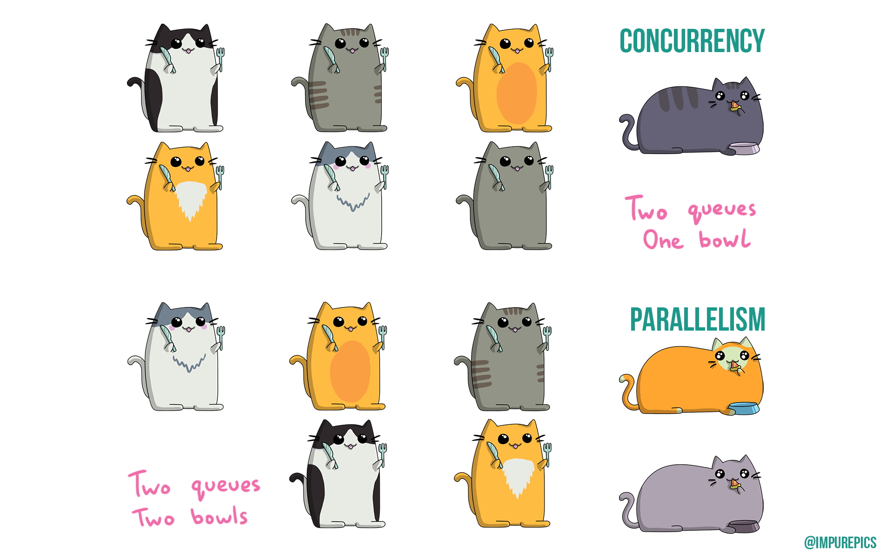
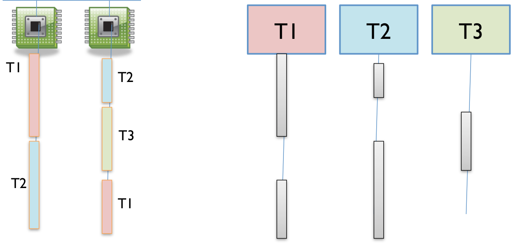
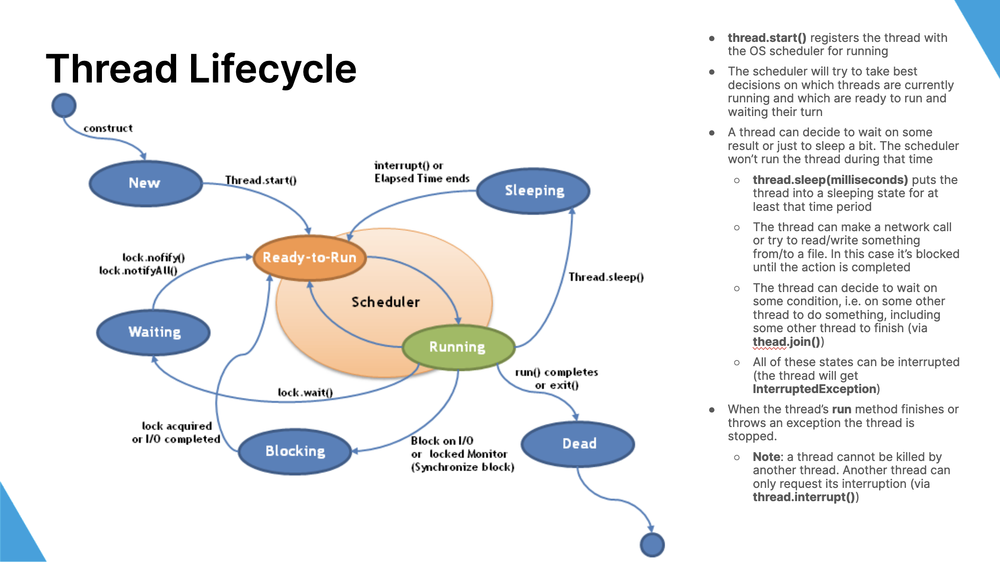
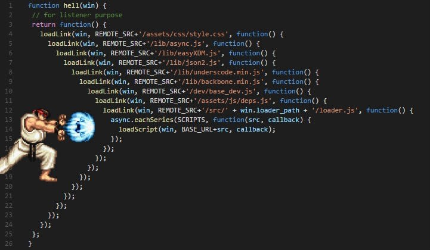
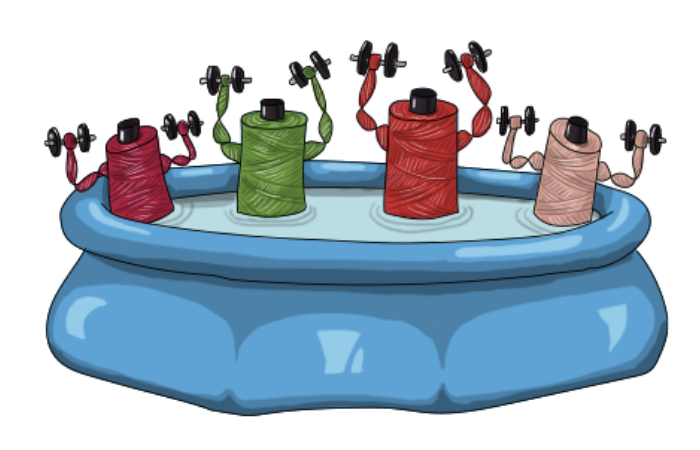

# Досега

::: incremental

* Програми с мощността на ламбда смятането/машината на Тюринг
* Нямат връзка с околния свят
* вход =&gt; предвидима трансформация =&gt; изход
* Трансформиращи програми
* Добре изучени, "лесни"

:::

# IO

```scala
import Console._

val program = for
  _     <- putStrLn("What is your name?")
  name  <- getStrLn
  _     <- putStrLn("Hello, " + name + ", welcome!")
yield ()

program.unsafeRun()
```

::: incremental

* Връзка с външния свят
* Но синхронна – програмата не прави нищо друго докато чака
* Интерактивни програми

:::

# Реалният свят

::: incremental

* Светът навън е силно паралелен и конкурентен
* Нещо повече, участниците в него си взаимодействат и реагират едни на други
* Развива се във времето
* Реактивни програми
* "Трудни", но и най-интересни :)
* Как да ги моделираме?

:::

# Конкурентност и паралелизъм


<div class="align">
  <dl class="fragment">
    <dt>parallel</dt>
    <dd>from παρά + ἄλληλος, along each other</dd>
  </dl>

  <dl class="fragment">
    <dt>concurrent</dt>
    <dd>present active participle of concurrō (“happen at the same time with”), from con- (“with”) + currō (“run”)</dd>
  </dl>

  <dl class="fragment">
    <dt>concurrent computing</dt>
    <dd>a form of computing in which several computations are executed during overlapping time periods—concurrently—instead of sequentially</dd>
  </dl>
</div>

# Конкурентност и паралелизъм

::: incremental

* конкурентност – когато няколко задачи имат възможност да прогресират в рамките на един и същи период от време, но не задължително едновременно
  - пример: multitasking позволява различни нишки, споделящи си едно процесорно ядро, да прогресират заедно, редувайки се коя ще използва ядрото
* паралелизъм – когато конкурентни задачи биват изпълнявани едновременно (по едно и също време)
  - пример: наличието на няколко ядра би ни позволило няколко нишки да прогресират едновременно

:::

# Конкурентност и паралелизъм



# Конкурентност

В изчислителен контекст:

::: incremental

* _конкурентността_ се отнася към структурата на програмата,
* _паралелизмът_ – към хардуера и как тя ще бъде изпълнявана.

:::

<p class=fragment>Конкурентните програми са композитност от unit-и от изчисления, които, веднъж дефинирани, могат да бъдат изпълнени независимо едно от друго.</p>

# Дистрибутирани системи

::: { .fragment }

Независими компоненти със собствени изчислителни ресурси и памет, които комуникират помежду си чрез съобщения и изграждат цялостна система

:::

::: { .fragment }

(обичайно) работят конкурентно и паралелно един спрямо друг

:::

::: { .fragment }

> "A distributed system is one in which the failure of a computer you didn't even know existed can render your own computer unusable."

:::

# Реактивност

<p class="fragment">Свойството на програмите/компонентите да реагират<br />на света около тях<span class="fragment"> (с което да са част от него)</span></p>

# Конкурентни модели

::: incremental

* От ниско ниво
  * Нишки
  * I/O и TCP/IP конкурентност
* Абстракции
  * Callbacks & event loop
  * Future/Promise & IO
  * Актьорски модел
  * Communicating Sequential Processes
  * Stream/dataflow конкурентност
  * ...нещо друго?
  
:::

# Какво би направило един модел подходящ?

::: incremental

* Ease to reason about it
* Expressive
* Safe
* Doesn't hide possibility for errors<span class="fragment"> (e.g. in a distributed setting)</span>
* Composable
* Functional programming to the rescue

:::

# Нишки

{ height=480 }

Кой е ползвал НИШКИ?

# Time slicing

Нишките се управляват от OS scheduler:

{ height=480 }

# Lifecycle

{ height=520 }

# Как си комуникират нишките?


# ...чрез споделено състояние!

::: incremental

* За да бъде смислен, всеки конкурентен примитив е нужно да има поне една интеракция с околния свят или с други примитиви
* Границите с дистрибутираните системи се размиват
* Нишки – чрез споделена памет и средства на процесора и ОС
* Модел на синхронизация:

  { height=420 }

:::

# Проблеми със споделеното състояние

::: incremental

* Видимост
  * ако нишка A промени стойност, тя ще бъде ли видяна от нишка B?
* Race condition
  * когато стигнем до невалидно или неконсистентно състояние 
  * най-често ако една нишка презапише резултатът от действията на друга

:::

# Видимост между нишки

::: { .fragment }

{ height=380 }

:::

::: { .fragment }

Видимост чрез `volatile`

:::

# Видимост между нишки –<br />happens-before релация

::: incremental

* Една нишка A вижда промените от друга B само ако те са __се случили преди__ определено действие на A
* Релацията __се случва преди__ се определя много строго по следната дефиниция:
  * Запис във `volatile` променлива __се случва преди__ последващо нейно прочитане (от същата или друга нишка)
  * За всеки два последователни statement-а в една нишка, първият __се случва преди__ вторият
  * Релацията е транзитивно затворена
* Образува се частична наредба между нишките

:::

# Видимост между нишки –<br />happens-before релация

::: incremental

* Всички други средства за конкурентност на Java също използват volatile семантиката
* Следователно дефиницията от предния слайд важи и за тях

:::

# Видимост между нишки

::: incremental

* Допълнително JVM ни гарантира:
  * всяка референция към immutable обект сочи към обект с напълно валидно състояние
* неизменимостта премахва огромен клас от възможни грешки

:::

# Проблеми на нишките

::: incremental

* Стартират бавно
* Тежки
  * всяка има стек, регистри
  * превключването между нишки е бавно и минава през ядрото на ОС
* Липсва реактивност
* Комплексни
  * комуникират чрез споделено състояние
  * изискват синхронизация
  * нишките са няколко императивни програми, изпълняващи се конкурентно
  * всяка със собствена времева линия, но недетерминистично преплетени на моменти
* Не се композират
* [The Problem with Threads](https://www2.eecs.berkeley.edu/Pubs/TechRpts/2006/EECS-2006-1.pdf)

:::

# Как да решим проблемите?

# Бавно стартиране – Thread pools

{ height=250 }

::: incremental

* вместо да стартираме и спираме нишки, ще опитаме да ги преизползваме
* ще разделим работата на задачи – можем да използваме `Runnable` интерфейса за тях
* задачите се изпращат към pool от нишки, готови да ги изпълнят, като ако няма свободна – изчакват
* всяка задача може да добави нови задачи по време на своето изпълнение

:::

#


::: { .fragment }

Ще ги разгледаме по-подробно по-късно

:::

# Реактивност – Callbacks


```scala
def doSomething(onComplete: Result => Unit): Unit
```

::: incremental

* Задействат се при завършване на работа или при определено събитие <span class="fragment">(естествени за event loop)</span>
* Асинхронни и реактивни
* Ще ги изпълним върху pool от нишки (брой = ~брой ядра)

:::

<div class="fragment">

```scala
def doSomethingDangerous(onComplete: Try[Result] => Unit): Unit
```

</div>

# Callback hell



# Callbacks – негативи

::: incremental

* Императивни, работят с mutable state
* Некомпозитни. Callback hell
* Ако се изпълняват в различни нишки, изискват синхронизация
* Ръчно спряване с грешки

:::

# Конкурентен IO

Какво бяхме постигнали с `IO`?

::: incremental

* Страничен ефект =&gt; функционален ефект
* Защо това ни харесва?
* Функционално композиране на ефекти
* Странични ефекти само при изпълнение

:::

#

Как би изглеждал конкурентен `IO`?

# Защо точно тези операции?

::: { .fragment }

[Лекция 2: Императивно срещу Функционално](02-fp-with-scala.html#/функционално-срещу-императивно)

:::

::: { .fragment }

При императивното всяка нишка описва собствена времева линия, преплитаща се с другите

:::

# Функционално програмиране

{ height="512" }

# Изрази

```scala
val a = 10
val b = 40

val c = a * 10
val d = (a, b)
val e = a + b

def f(x: Int): String = ???
def g(x: String): Boolean = ???

def r = g(f(a))
```

# Ефектни изрази

```scala
val a = IO(10)
val b = IO(40)

val c = a.map(_ * 10)
val d = a zip b
val e = a.zipMap(b)(_ + _)

def f(n: Int): IO[String] = ???
def g(str: String): IO[Boolean] = ???

def r = a.flatMap(f).flatMap(g)
```

# Ефектни изрази

```scala
val a = IO(10)
val b = IO(40)

val c = a.map(_ * 10)
val d = a zip b
val e = a.zipMap(b)(_ + _)

def f(n: Int): IO[String] = ???
def g(n: Int, str: String): IO[Boolean] = ???

def r = for
  n <- a
  str <- f(n)
  bool <- g(n, str)
yield bool
```

# Имплементация

# Реактивност на `IO`

<!--

* Ще се базираме на callback – `onComplete`
* Функционалните трансформации – чрез `onComplete`
* Трансформиран `Future` също е реактивен
* Как да го вържем с външни източници на събития?
* Promise
  * Promise-ите ще генерират първоначални Future-и в нашата система
  * Адаптер към външния свят – реагират на събития за вход/изход

-->

<!--
  * изпълнява се когато неговите зависимостти завършат (като реакция)
  * при завършване зависимите от него трансформации могат да се изпълнят
-->

# Примери

# Immutability

IO е безопасен, само ако стойностите в него са immutable!

<p class="fragment">Ако не са, то тяхното състояние може да е неизвестно</p>

# Какви thread pools да ползваме? CPU-bound vs IO-bound

# CPU-bounded задачи

* Препоръка: thread pool с размер броя ядра
  * Повече няма да подобрят производителността
* Приложния код и леки трансформации също могат да вървят в този thread pool
* Често имплементират work-stealing алгоритми (напр. Fork Join Pool)

{ height=280 }

# IO-bounded задачи

* При синхронен вход/изход всяка операции блокира нишката
  * Тя не прави нищо през това време
* Ако искаме да постигнем добро ниво на конкурентност са ни нужни повечко нишки
* CachedThreadPool позволява добавяне на нишки при нужда

{ height=280 }

# Event-dispatcher IO

* Една нишка се справя с множество IO операции
  * асинхронен вход/изход
* Имплементира се event loop
  * Още се нарича reactor pattern
* Използва се една или малко на брой нишки
* Препоръчва се в съвременни приложения с много клиенти

{ height=280 }

# Асинхронен вход/изход чрез `IO`

::: { .fragment }

Как работи HTTP?

:::

# Какво направихме предния път?

IO, със следната функционалност:

* Delayed
  * поддържа пускане на изчисление асинхронно (в CPU-bounded thread pool)
* Блокиращ Delayed
  * позволява да изпълним синхронен блокиращ вход/изход в отделен thread pool (IO-bounded)
* Concurrent
  * може да изпълни две IO-та конкурентно едно от друго и да изчака резултата им
* Async
  * може да адаптира callback-базиран API, включително такива за неблокиращ вход/изход

# `IO` със Cats Effect


# Cats Effect `IO` разлики

+------------------------+---------------------------+
| Нашето IO              | Cats Effect IO            |
+------------------------+---------------------------+
| IO.apply, IO.blocking  | IO.apply, IO.blocking     |
+------------------------+---------------------------+
| IO.of, IO.error        | IO.pure, IO.raiseError    |
+------------------------+---------------------------+
| IO.println, IO.readln  | IO.println, IO.readline   |
+------------------------+---------------------------+
| IO.async               | IO.async_, IO.async       |
+------------------------+---------------------------+
| map, flatMap, >>=, >>  | map, flatMap, >>=, >>     |
+------------------------+---------------------------+
| flatMapError           | handleErrorWith           |
+------------------------+---------------------------+
| zip, zipMap            | parProduct, --            |
+------------------------+---------------------------+
| --                     | parTupled, parMapN        |
+------------------------+---------------------------+

Някои от тези изискват `import cats.syntax.all.*`

# Използване на Cats Effect `IO` (демо)

# Web библиотека (демо)

# Полезни функции

* `parSequence`
* `recover`
* `recoverWith`
* `orElse`
* `IO.race`

# Неопределен брой независими изчисления

```scala
def retrieveAge(userId: Id): IO[Int] = ???

def averageFriendsAge(user: User): IO[Option[Int]] = for
  friendIds: List[Id] <- user.friends
  friendsAges: List[IO[Int]] = friendIds.map(retrieveAge)
  ages <- friendsAges.sequence: IO[List[Int]]
yield average(ages)
```

# Recover

```scala
def doSomethingForUser(userId: Id): IO[HttpResponse] =
(for
  user <- retrieveUser(userId)
  result <- doService(user, input)
yield Ok(constructBody(result))).recover:
  case UserNotFound(userId) => NotFound
  case _: ActionNotPermitted => Unauthorized
```

# Recover with друга, по-стабилна алтернатива

```scala
def dangerousService(input: ServiceInput): IO[Result] = ???
def safeService(input: ServiceInput): IO[Result] = ???

def calculate(input: ServiceInput): IO[Result] =
  dangerousService(input).recoverWith:
    case _: ServiceFailure => safeService(input)

```

# Fallback

```scala
def dangerousService(input: ServiceInput): IO[Result] = ???
def safeService(input: ServiceInput): IO[Result] = ???

def calculate(input: ServiceInput): IO[Result] =
  dangerousService(input).orElse(safeService(input))

```

# Състезание

```scala
def algorithm1(input: String): IO[Int] = ???
def algorithm2(input: String): IO[Int] = ???

def calculation(input: Stirng): IO[Int] =
  IO.race(algorithm1(input), algorithm2(input))

```

# Cancellation

# Future и Promise

::: incremental

* Част от стандартната библиотека на Scala
* Стартират изпълнение веднага щом бъдат дефинирани (а не при unsafeRun)
  * това води до някои проблеми
* Подобни на CompletableFuture в Java и Promise в JavaScript
  * те имат същите проблеми

:::

# Future и Promise API

+----------------------------------+---------------------------+
| Future                           | Cats Effect IO            |
+----------------------------------+---------------------------+
| Future.apply                     | IO.apply, IO.blocking     |
+----------------------------------+---------------------------+
| Future.successful, Future.failed | IO.pure, IO.raiseError    |
+----------------------------------+---------------------------+
| --                               | IO.println, IO.readline   |
+----------------------------------+---------------------------+
| Promise, promise.complete        | IO.async_, IO.async       |
+----------------------------------+---------------------------+
| map, flatMap                     | map, flatMap, >>=, >>     |
+----------------------------------+---------------------------+
| transform, recoverWith, ..     . | handleErrorWith и други   |
+----------------------------------+---------------------------+
| zip                              | parProduct,  --           |
+----------------------------------+---------------------------+
| zip, zipWith                     | parTupled, parMapN        |
+----------------------------------+---------------------------+
| Future.sequence                  | sequence                  |
+----------------------------------+---------------------------+
| fallback                         | orElse                    |
+----------------------------------+---------------------------+

# Референтна прозрачност

```scala
def calc[T](expr: => T) = Future {
  Thread.sleep(4000)

  expr
}
```

::: { .fragment }

```scala
val futureA = calc(42)
val futureB = calc(10)

val sum = for
  a <- futureA
  b <- futureB
yield a + b

println {
  Await.result(sum, 5.seconds)
}
```

:::

::: { .fragment }

```
> 52
```

:::

# Референтна прозрачност

```scala
def calc[T](expr: => T) = Future {
  Thread.sleep(4000)

  expr
}
```

```scala


val sum = for
  a <- calc(42)
  b <- calc(10)
yield a + b

println {
  Await.result(sum, 5.seconds)
}
```

::: { .fragment }

```
> Exception in thread "main" java.util.concurrent.TimeoutException: Futures timed out after [5 seconds]
```

:::

# Правилният начин да постигнем паралелилизъм:

```scala
val sum = for
  (a, b) <- calc(42).zip(calc(10))
yield a + b

println {
  Await.result(sum, 5.seconds)
}
```

```
> 52
```

# Референтна прозрачност (пример 2)

```scala
def calc[T](expr: => T) = Future {
  println("Hello")
  
  Thread.sleep(4000)

  expr
}
```

```scala
val futureCalc = calc(42)

val sum = for
  (a, b) <- futureCalc zip futureCalc
yield a + b

println {
  Await.result(sum, 5.seconds)
}
```

::: { .fragment }

```
Hello
> 52
```

:::

# Референтна прозрачност (пример 2)

```scala
def calc[T](expr: => T) = Future {
  println("Hello")
  
  Thread.sleep(4000)

  expr
}
```

```scala


val sum = for
  (a, b) <- calc(42) zip calc(42)
yield a + b

println {
  Await.result(sum, 5.seconds)
}
```

::: { .fragment }

```
Hello
Hello
> 52
```

:::

# Въпроси :)?

# Докъде сме?

::: { .fragment }

[Аспекти на ФП](02-fp-with-scala.html#/как-да-пишем-функционално)

:::

::: { .fragment }

Следващия път ще си поговорим повече за абстракции

:::